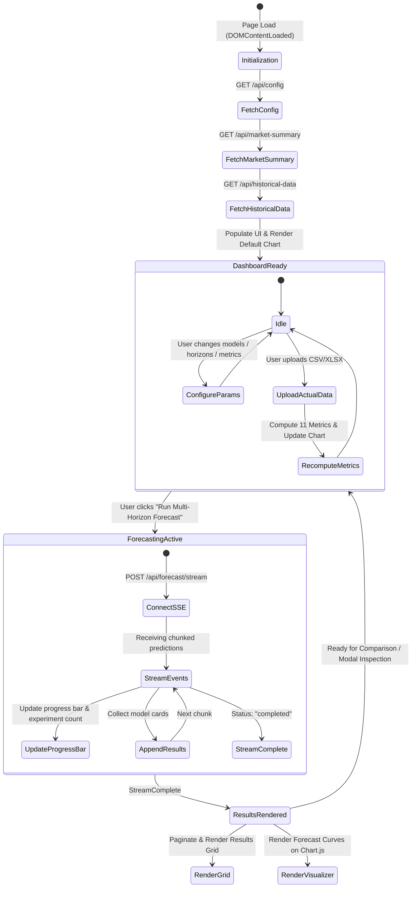

# Multi-Horizon Copper Forecasting System – UI/UX Technical Architecture & Specification Document

---

## 1. Executive Summary & Design System

The **Multi-Horizon Copper Price Forecasting System** features an institutional-grade, dark-themed analytical dashboard inspired by Bloomberg Terminal and TradingView interfaces. The user interface bridges high-frequency commodity market surveillance with direct multi-horizon econometric and machine learning forecasts across 1 to 90 working days, with zero data leakage guarantees.

### 1.1 Core Design Principles
* **Institutional Aesthetics:** High-contrast dark theme optimized for sustained analytical work, deep navy-slate card containers, vivid accent highlights (electric cyan, amber, emerald, and ruby red).
* **Glassmorphic Depth:** Semi-transparent backdrop filters, refined borders (`rgba(255, 255, 255, 0.08)`), and multi-layered elevation box shadows.
* **Zero Latency Feedback:** Real-time Server-Sent Events (SSE) progress tracking, instant client-side pagination, search filtering, and synchronous Chart.js canvas rendering.
* **Information Density:** Compact, high-utility layouts displaying macroeconomic indicators, model confidence bands, performance scorecards, and day-by-day variance breakdowns without cognitive overload.

---

## 2. Design System Tokens & Color Palette

```css
:root {
  /* Core Canvas & Surfaces */
  --bg-primary: #0a0e17;           /* Deep terminal background */
  --bg-secondary: #111827;         /* Container cards background */
  --bg-card: #162032;              /* Elevated widgets and cards */
  --bg-card-hover: #1c2a42;        /* Hover elevation */
  --bg-glass: rgba(22, 32, 50, 0.85); /* Frosted modal & drawer surface */

  /* Border & Dividers */
  --border-subtle: #1f2d42;        /* Card dividers */
  --border-focus: #3b82f6;         /* Focused inputs and active buttons */
  --border-cyan: #06b6d4;          /* Prediction accent borders */

  /* Accent & Telemetry Colors */
  --accent-cyan: #06b6d4;          /* Predicted price trajectory */
  --accent-blue: #3b82f6;          /* Primary buttons & system signals */
  --accent-amber: #f59e0b;         /* Actual market close ground truth */
  --accent-green: #10b981;         /* Positive returns & UP match */
  --accent-red: #ef4444;           /* Negative returns & DOWN miss */
  --accent-purple: #8b5cf6;        /* Stacking Ensemble & AI badges */

  /* Typography Colors */
  --text-primary: #f8fafc;        /* High-contrast headings and active metrics */
  --text-secondary: #94a3b8;      /* Parameter labels and subtexts */
  --text-muted: #64748b;          /* Inactive chips and unit suffixes */

  /* Performance Tier Grading */
  --tier-best: #10b981;           /* ⭐ Best (Top Decile) */
  --tier-good: #3b82f6;           /* ✅ Good (Within Tolerance) */
  --tier-average: #f59e0b;        /* ⚠️ Average */
  --tier-poor: #ef4444;           /* ❌ Poor (High Error) */
}
```

---

## 3. UI Component Hierarchy & Architecture Map

```text
App Container (.app-container)
│
├── 1. Top Navigation Bar (.app-header)
│   ├── Platform Branding & Subtitle ("Zero Data Leakage Certified")
│   └── Telemetry Badges (Stationary Features, Zero Leakage Audit, SSE Active)
│
├── 2. Live Market Surveillance Ticker (.market-summary-section)
│   └── 8 Dynamic Metric Cards Grid:
│       ├── Copper Open ($/lb or $/MT)
│       ├── Copper High ($/lb)
│       ├── Copper Low ($/lb)
│       ├── Copper Close (Last + Change % badge)
│       ├── LME Copper Stocks (MT Inventory)
│       ├── Crude Oil WTI ($/bbl Energy Driver)
│       ├── US Dollar Index (DXY Currency Factor)
│       └── US 10Y Rate & Cash-3M Basis Spread ($/t)
│
├── 3. Forecasting Configuration Console (.forecast-control-section)
│   ├── Model Multi-Select Dropdown & Chips (9 Supported Models)
│   ├── Metrics Selection Dropdown (11 Evaluated Metrics)
│   ├── Horizon Selection Tabs & Chips:
│   │   ├── Fixed Horizons: [1D, 7D, 15D, 30D, 60D, 90D]
│   │   └── Continuous Ranges: [1-7D, 1-15D, 1-30D, 1-60D, 1-90D]
│   ├── Train/Val/Test Ratio Selector (60-40, 70-30, 75-25, 80-20, 85-15)
│   ├── Hyperparameter Auto-Tuning Switch
│   └── Execution Trigger: "🚀 Run Multi-Horizon Forecast"
│
├── 4. Streaming Execution & Telemetry Strip (.progress-section)
│   ├── Real-Time Progress Bar (0.0% to 100.0%)
│   └── Live Experiment Telemetry: Current Model, Horizon, Ratio, Metric, Completed Count
│
├── 5. Interactive Forecast Visualizer (.visualizer-section)
│   ├── Mode Switcher Tabs:
│   │   ├── 🎯 Forecast vs Actual Mode (Overlay comparison)
│   │   └── 📊 Historical Overview Mode (Multi-year macro context)
│   ├── Quick Action Toolbar:
│   │   ├── Model & Ratio Dropdown Selectors
│   │   ├── Horizon Slicing Buttons (ALL, 7D, 15D, 30D, 60D, 90D)
│   │   ├── Zoom & Pan Controls (Zoom In, Zoom Out, Reset)
│   │   ├── Inline Actual Data Upload Trigger
│   │   └── Fullscreen Canvas Expand Trigger (⛶ Expand)
│   ├── Main Chart.js Dual-Engine Canvas (#main-forecast-chart)
│   ├── Dynamic 11-Metric Comparison Cards Panel (#comp-metric-cards-grid)
│   └── Expandable Day-by-Day Forecast vs Actual Data Drawer (#chart-table-drawer)
│
├── 6. Comprehensive Forecasting Results Grid (.results-section)
│   ├── Action & Filter Bar:
│   │   ├── Horizon Filter (ALL, 1, 7, 15, 30, 60, 90)
│   │   ├── Model Filter (ALL or specific model)
│   │   ├── View Switcher: [Grid View] vs [Matrix View]
│   │   ├── Global Actual Market Data Uploader (.csv, .xlsx)
│   │   └── Export Actions: [CSV Export] & [JSON Export]
│   ├── Paginated Results Data Grid (15, 25, 50, 100, 250 rows / page)
│   │   ├── 20 Descriptive Columns (Predictions, Errors, R², Audit, Chart Launcher)
│   │   └── Pagination Controls (First, Prev, Page Index, Next, Last)
│   └── Cross-Model Comparison Matrix View (#result-matrix-container)
│
├── 7. Fullscreen Modal Dialog (.card-expand-modal-backdrop)
│   ├── Modal Header: Model Title, Horizon Label, Ratio Badge, Leakage Certification
│   ├── Hero KPI Metrics Strip: Predicted Price, Actual Price, Delta, Direction Match
│   ├── High-Resolution Chart Canvas (#modal-expanded-chart)
│   ├── 11-Metric Comprehensive Evaluation Grid
│   └── Complete Day-by-Day Forecast vs Actual Breakdown Table
│
└── 8. Platform Footer (.app-footer)
    ├── Certified Model List & Zero Data Leakage Standards
```

---

## 4. Section-by-Section Deep Dive

### 4.1 Top Navigation Bar & Leakage Shield Badges
* **Logo & Title:** Displays the system title with institutional typography.
* **Leakage Guard Badges:**
  * `🛡️ ZERO LOOKAHEAD BIAS`: Visual confirmation that all features use `t-1` historical shifts.
  * `📈 STATIONARY I(0) FEATURES`: Confirms dimensionless relative return transformations.
  * `⚡ SSE STREAMING`: Indicates asynchronous WebSocket/SSE pipeline connectivity.

### 4.2 Market Surveillance Ticker Grid
Arranged in a responsive 8-column card grid (collapsing to 4 columns on tablets and 2 columns on mobile):
1. **Copper Open:** Session opening price with currency formatting (`$4.5200`).
2. **Copper High:** Intraday/session ceiling with emerald coloring.
3. **Copper Low:** Intraday/session floor with ruby red coloring.
4. **Copper Close (Last):** Highlighted card displaying the latest benchmark close and a 24-hour delta badge (`+$0.0350 (+0.78%)`).
5. **LME Copper Stocks:** Physical inventory in metric tons (`148,250 MT`).
6. **Crude Oil (WTI):** Energy cost baseline driver (`$76.40/bbl`).
7. **US Dollar Index (DXY):** Foreign exchange purchasing power indicator (`104.25`).
8. **US 10Y Yield & Basis Spread:** Combined financial driver showing the 10-year risk-free rate (`4.25%`) and the 3M-Cash contango/backwardation spread (`+$12.50/t`).

---

### 4.3 Forecast Control Console

The control console configures and triggers multi-horizon machine learning runs:

| Control Element | UI Mechanism | Options / Functionality |
| :--- | :--- | :--- |
| **Model Selector** | Custom Multi-Select Dropdown with Checkboxes + Tag Chips | **9 Models:** XGBoost, CatBoost, LightGBM, RandomForest, Stacking Ensemble, Stage Regression, ARIMA, SARIMAX, LSTM. Allows "Select All" or custom subset. |
| **Target Metrics** | Dropdown with Checkbox Grid | **11 Metrics:** MAE, RMSE, MAPE, sMAPE, R², Directional Accuracy, UP Accuracy, DOWN Accuracy, Max Absolute Error, Mean Error (Bias), Error Std Dev. |
| **Horizon Presets** | Interactive Pill Chips | **Fixed Horizons:** 1D, 7D, 15D, 30D, 60D, 90D.<br>**Continuous Ranges:** 1-7D, 1-15D, 1-30D, 1-60D, 1-90D. |
| **Chronological Split** | Segmented Single-Choice Dropdown | 60-40, 70-30, 75-25, 80-20, 85-15 (Strict train < val < test time ordering without shuffling). |
| **Hyperparameter Tuning** | Toggle Switch | Activates rolling TimeSeriesSplit cross-validation tuner for optimal model weights. |
| **Run Trigger** | Primary Gradient Button | Triggers `/api/forecast/stream` via EventSource and mounts the progress bar. |

---

### 4.4 Real-Time Execution & Progress Bar
When the forecast job starts:
1. The **Progress Section** unhides with a smooth CSS fade-in.
2. The **Progress Fill Bar** increments smoothly from 0% to 100%.
3. Live experiment telemetry cards update in real time:
   * **Current Model:** e.g., `XGBoost`
   * **Current Horizon:** e.g., `15 Days`
   * **Current Ratio:** e.g., `80-20`
   * **Optimizing Metric:** e.g., `RMSE`
   * **Progress Counter:** e.g., `Completed: 24 / 90 Experiments (26.7%)`

---

### 4.5 Dual-Engine Visualizer Section

The interactive visualization card contains a high-performance Chart.js canvas with two distinct viewing modes:

#### Mode 1: 🎯 Forecast vs Actual Mode
* **Historical Anchor Line:** Shows recent actual closing prices up to origin date $t$.
* **Forecast Trajectory (Cyan `#06b6d4`):** Plots multi-horizon predicted prices $t+1 \dots t+h$ forward in time, stepping exclusively across business days (excluding weekends).
* **Actual Ground Truth Line (Amber `#f59e0b`):** Appears when actual market data is uploaded, displaying true observed prices.
* **Forecast Error Fill Band:** Semi-transparent shaded area between prediction and actual lines, visualizing over-estimation or under-estimation.
* **Interactive Tooltips:** Displays Date, Predicted Price, Actual Price, Dollar Spread, Error Percentage, and Direction Status.

#### Mode 2: 📊 Historical Overview Mode
* Displays 60D, 180D, 1Y, or full history of copper prices with volume bars and macroeconomic overlays (DXY, Crude Oil, Interest Rate).

#### Visualizer Quick Action Toolbar:
* **Model Dropdown:** Switch the active forecast overlay between models or select "Best Across Horizons".
* **Horizon Range Slicers:** Quick-filter chart view to 7D, 15D, 30D, 60D, 90D, or ALL.
* **Interactive Zoom & Pan:** Native canvas zoom-in, zoom-out, and reset view buttons.
* **Inline Upload:** Upload actual test data files directly from the visualizer header.
* **Fullscreen Expand (⛶ Expand):** Opens the canvas in an expanded modal view.

---

### 4.6 Performance Evaluation Center & 11-Metric Scorecard

Positioned below the visualizer, this panel activates when actual market data is matched against predictions:

* **Category Filters:** `All Metrics (11)`, `⭐ Best & Good`, `🎯 Primary`, `📈 Accuracy`, `📉 Error`, `🧭 Directional`.
* **Focus Metric Selector:** Allows drilling down to a single metric.
* **Performance Tier Filter:** Filter by grade (⭐ Best, ✅ Good, ⚠️ Average, ❌ Poor).
* **11 Dynamic Metric Cards:**
  1. **MAE (Mean Absolute Error):** Average dollar error magnitude.
  2. **RMSE (Root Mean Squared Error):** Penalizes large outlier deviations.
  3. **MAPE (% Error):** Mean Absolute Percentage Error.
  4. **sMAPE (% Symmetric Error):** Bounded percentage error resisting scale distortions.
  5. **R² (Coefficient of Determination):** Variance explained by the model ($1.0$ is perfect).
  6. **Directional Accuracy (%):** Percentage of correct upward or downward movement calls.
  7. **UP Directional Accuracy (%):** Hit rate specifically when market moved up.
  8. **DOWN Directional Accuracy (%):** Hit rate specifically when market moved down.
  9. **Max Absolute Error ($):** Worst-case single session error.
  10. **Mean Error / Bias ($):** Identifies systematic over-forecasting (+) or under-forecasting (-).
  11. **Error Standard Deviation ($):** Consistency and dispersion of forecast errors.

---

### 4.7 Day-by-Day Forecast vs Actual Table Drawer
An accordion drawer beneath the chart providing a tabular inspection of every target date:
* **Columns:** Day #, Target Date (Working Days), Predicted Price ($), Actual Price ($), Difference ($), Error (%), Direction Match Badge (✓ UP Matched / ✗ DOWN Missed).

---

### 4.8 Paginated Results Data Grid & Matrix View

#### Grid View:
* **Pagination Bar:** Configurable page size (15, 25, 50, 100, 250, or ALL records) with First, Previous, Page Index, Next, Last navigation.
* **Interactive Sorting & Filtering:** Filter by Horizon (1D to 90D) or Model.
* **Table Columns:**
  1. `#` (Row index)
  2. `Model` (Algorithm badge)
  3. `Horizon` (Forecast days)
  4. `Ratio` (Train/Val/Test split)
  5. `Target Date` (Working day projected date)
  6. `Predicted Price` ($/lb)
  7. `Expected Change` ($ delta & %)
  8. `Target Metric` (Tuned objective)
  9. `Actual Price` (Ground truth if available)
  10. `Difference ($)`
  11. `Error (%)`
  12. `Direction Match`
  13. `MAE`
  14. `RMSE`
  15. `MAPE`
  16. `R²`
  17. `Dir. Acc (%)`
  18. `Leakage Audit` (🛡️ Pass)
  19. `Tuning` (Best Hyperparameters)
  20. `Chart View` (Interactive button to load into visualizer)

#### Matrix View:
* Switches the layout to a cross-model benchmark matrix comparing all algorithms side-by-side across identical horizons and ratios.

#### Global Data Export:
* **Export CSV:** Downloads complete forecasting experiments as an RFC-4180 CSV file.
* **Export JSON:** Exports complete nested execution trees for downstream analytical consumption.

---

### 4.9 Dedicated Fullscreen Card Expansion Modal

Clicking the expand button on any experiment card or visualizer launches the dedicated fullscreen inspection modal:
* **Modal Header:** Algorithm badge, horizon window, chronological split ratio, and zero-leakage badge.
* **Hero Comparison Strip:** Target Predicted Price (Cyan), Actual Market Close (Amber), Dollar Difference, Direction Match Indicator, and Total Matched Days.
* **High-Resolution Chart Canvas:** Fullscreen Chart.js view with custom zoom and pan controls.
* **Complete 11-Metric Scorecard:** All 11 metrics with color-coded performance tier badges.
* **Day-by-Day Breakdown Table:** Scrollable comparison of predictions vs actuals for all days in the horizon.
* **Keyboard Navigation:** Press `Escape` to close the modal instantly.

---

## 5. Frontend State Machine & Lifecycle

The dashboard logic is encapsulated in [`static/app.js`](file:///c:/Users/Naveen/OneDrive/Desktop/Copper%20Prediction/static/app.js) with the following lifecycle:



---

## 6. Business Day (Working Day) Target Date Calculation

To ensure realism and prevent calendar mismatches with physical financial exchanges, the frontend and backend strictly calculate future target dates across **working days only** (Monday through Friday, excluding Saturdays and Sundays):

$$\text{TargetDate}(t, h) = t + \sum_{k=1}^{h} \Delta \text{Day}_k \quad \text{where } \text{Weekday}(\text{TargetDate}) \in [0, 4]$$

* A 1-day forecast from Friday targets **Monday**.
* A 7-day forecast from Monday targets **Wednesday of the following week**.
* Eliminates synthetic weekend market dates and aligns with actual exchange settlements.

---

## 7. Responsive Design Breakpoints

| Device Category | Screen Width | Layout Adjustments |
| :--- | :--- | :--- |
| **Ultra-Wide Desktop** | $\ge 1440\text{px}$ | 8-card market ticker grid, side-by-side config controls, wide data tables. |
| **Standard Desktop / Laptop** | $1024\text{px} - 1439\text{px}$ | 4-column market ticker grid, stacked config layout, horizontal table scrolling. |
| **Tablet** | $768\text{px} - 1023\text{px}$ | 2-column market ticker grid, collapsible drawers, full-width modal dialogs. |
| **Mobile** | $< 768\text{px}$ | Single-column market cards, stacked metric cards, condensed paginated table views. |

---

## 8. Summary of UI File Artifacts

| File Path | Description | Key Responsibilities |
| :--- | :--- | :--- |
| [`static/index.html`](file:///c:/Users/Naveen/OneDrive/Desktop/Copper%20Prediction/static/index.html) | Main HTML structure | Semantic markup, modal definitions, canvas containers, SVG iconography, table templates. |
| [`static/style.css`](file:///c:/Users/Naveen/OneDrive/Desktop/Copper%20Prediction/static/style.css) | Complete stylesheet | CSS design tokens, glassmorphism, responsive grid definitions, keyframe animations. |
| [`static/app.js`](file:///c:/Users/Naveen/OneDrive/Desktop/Copper%20Prediction/static/app.js) | Frontend application logic | Chart.js engine, SSE event streaming, client pagination, upload parser, 11-metric evaluator. |
